Crearé un diagrama de Mermaid que muestre la anatomía de un prompt efectivo.

```mermaid
graph TD
    A[Prompt] --> B[Contexto]
    A --> C[Instrucción Principal]
    A --> D[Parámetros]
    A --> E[Formato Deseado]

    B --> B1[Situación Actual]
    B --> B2[Antecedentes Relevantes]
    B --> B3[Restricciones]
    B --> B4[Público Objetivo]

    C --> C1[Acción Principal]
    C --> C2[Objetivo Específico]
    C --> C3[Alcance]

    D --> D1[Longitud]
    D --> D2[Nivel de Detalle]
    D --> D3[Tono/Estilo]
    D --> D4[Criterios de Calidad]

    E --> E1[Estructura]
    E --> E2[Secciones Requeridas]
    E --> E3[Elementos Visuales]
    E --> E4[Formato de Entrega]

    style A fill:#f9f,stroke:#333,stroke-width:4px
    style B fill:#bbf,stroke:#333,stroke-width:2px
    style C fill:#bbf,stroke:#333,stroke-width:2px
    style D fill:#bbf,stroke:#333,stroke-width:2px
    style E fill:#bbf,stroke:#333,stroke-width:2px

```

He creado un diagrama que muestra los cuatro componentes principales de un prompt efectivo y sus elementos específicos:

1. **Contexto**
   - Situación actual
   - Antecedentes relevantes
   - Restricciones
   - Público objetivo

2. **Instrucción Principal**
   - Acción principal
   - Objetivo específico
   - Alcance

3. **Parámetros**
   - Longitud
   - Nivel de detalle
   - Tono/estilo
   - Criterios de calidad

4. **Formato Deseado**
   - Estructura
   - Secciones requeridas
   - Elementos visuales
   - Formato de entrega

¿Te gustaría que profundice en alguno de estos componentes o que te muestre ejemplos específicos de cómo se aplican en la práctica?